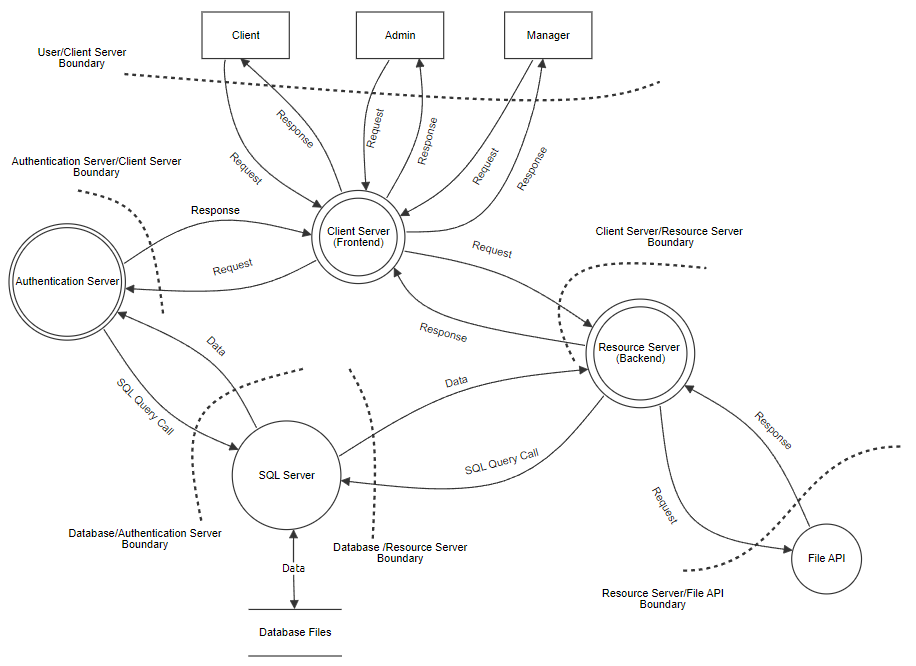

# Modelo de Ameaças

## Decomposição do Sistema

### Dependências Externas

Na tabela que se segue, são apresentadas todas as dependências externas que poderão ser  utilizadas como pontos de ataque. A sua identificação será feita com recurso a:

1. ID - Um identificador único para cada dependência
2. Descrição - Explicação da dependência

| ID | Descrição |
|----|-----------|
| 1  |           |
| 2  |           |

### Pontos de Entrada

Os pontos de entrada representam interfaces com que os atacantes poderão interagir de forma a atacar a aplicação. Na table seguinte, são apresentados os pontos de entrada do sistema em estudo, organizando a informação destes da seguinte forma:

1. ID - Um identificador único para cada ponto de entrada
2. Nome - Um nome que identifica o ponto de entrada
3. Descrição - Descrição que fornece alguns detalhes sobre o ponto de entrada
4. Nivel de Confiança - Nível de acesso necessário para cada ponto de entrada

| ID | Nome | Descrição | Nível de Confiança |
|----|------|-----------|--------------------|
| 1  |      |           |                    |
| 2  |      |           |                    |

### Ativos

Na tabela seguinte são apresentados todos os ativos que foram possíveis identificar como fontes de interesse no caso de um ataque. Estes ativos podem ser tanto fisicos como abstratos e a sua informação está organizada da seguinte forma:

1. ID - Um identificador único para cada ativo
2. Nome - Um nome que identificada cada ativo
3. Descrição - Descrição que fornece alguns detalhes sobre o ativo e o porque de ser importante a proteção deste.
4. Nível de Confiança - Nível de acesso necessário para o ativo

| ID | Nome | Descrição | Nível de Confiança |
|----|------|-----------|--------------------|
| 1  |      |           |                    |
| 2  |      |           |                    |

### Níveis de Confiança

Os níveis de confiança representam os tipos de acesso ao sistema que diferentas entidades externas podem ter, definindo privilégios e direitos de acesso necessários para cada ativo. Os níveis de confiança serão apresentados segundos os seguintes parâmetros:

1. ID - Identificador único para cada nível de confiança.
2. Nome - Nome descritivo para identificar cada nível de confiança.
3. Descrição - Descrição acerca da entidade a quem o nível é concedido.

| ID | Nome                                 | Descrição                                                                                                                             |
|----|--------------------------------------|---------------------------------------------------------------------------------------------------------------------------------------|
| 1  | Utilizador anónimo                   | Utilizador que interage com o sistema mas nao forneceu credenciais de login                                                           |
| 2  | Utilizador com credenciais válidas   | Utilizador que interage e se conecta com o sistema após um login com sucesso                                                          |
| 3  | Utilizador com credenciais inválidas | Utilizador que interage com o sistema e tenta se conectar com o mesmo mas não fornece credenciais válidas                             |
| 4  | Administrador do sistema             | O administrador que possui permissões para qualquer tipo de operação no sistema                                                       |
| 5  | Manager                              | O manager que possui permissões especificas para adicionar criar/remover produtos e promoçoes tal como ver todas as vendas do sistema |
| 6  | Cliente                              | O cliente que possui permissões para procurar/comprar produtos e fazer encomendas                                                     |
| 7  | Processo de serviço web              | O processo de serviço web que tem acesso a todas as componentes do sistema                                                            |

## Data Flow

Nesta secção, é apresentado o Data Flow Diagram que explica como os dados são transmitidos pelos diferentes componentes do sistema.

Assim sendo, tal como é possível observar existem 5 componentes no sistema: o Client Server, o Resource Server, o Authentication Server, a base de dados (SQL Server) e o sistema de gestão de ficheiros (File API).
Adicionalmente é possível identificar que os diferentes utilizadores fazem pedidos ao Client Server que por sua vez irá fazer pedidos ao Authentication Server e ao Resource Server que se necessário irão fazer pedidos ao SQL Server para armazenamento de dados ou no caso do Resource Server à File API para gestão de ficheiros.
Cada um destes por sua vez irá enviar resposta a cada componente que fez o pedido, ou seja, o SQL Server irá responder ao Authentication Sercer e ao Resource Server, a File API ao Resource Server, o Resource Server e o Authentication Server ao Client Server que por fim devolverá a resposta ao cliente.

## Determinação de Ameaças

Nesta secção será apresentada como a determinação de ameaças foi realizada.

### Ranking de Ameaças e Modelo de Risco Qualitativo