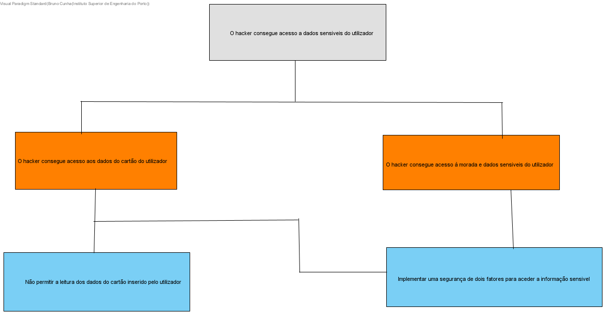
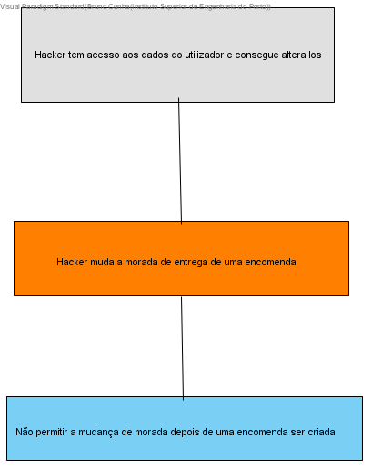

# Determinar Ameaças - Caso de Uso de Visualizar o Perfil do Utilizador

De forma a determinar as ameaças existentes no caso de uso de login irá ser utilizado a mnemônica STRIDE, e a sua lista de possíveis ameaças.

## Descrição do Caso de Uso

```
As a User
I want to be able to see a my user information
So that I can easily change it if needed
```

## Possíveis Ameaças no Caso de Uso

Através da lista de ameaças STRIDE é possível identificar 1 possível ameaça providiente do caso de uso de um utilizador ver as suas informações.

- Uma ameaça Tampering pode ser detetada.
- Uma ameaça de risco para os utilizadores e não o sistema em si.

## Análise das Ameaças

### Risco para a Segurança dos Utilizadores



Como é possível observar o diagrama acima o Hacker pode tentar utilizar as informações do utilizador disponiveis no site para tentar contra o mesmo.
A falta de proteção destes dados pode levar a grandes riscos de segurança para os utilizadores.

### Tampering



Como é possivel ver na imagem acima um misuse case onde o hacker pode alterar o local de entrega de uma encomenda e assim ficar com os produtos comprados por outra pessoa, criando assim problemas para a empresa e o utilizador.
