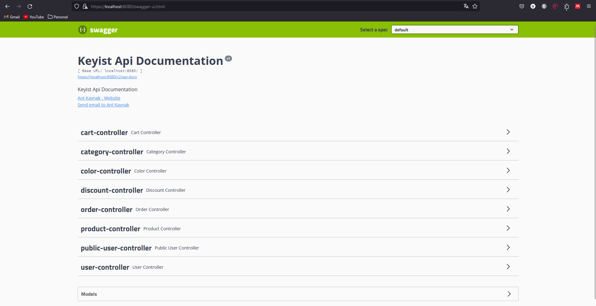

### Autenticação através de HTTPS

Foi implementada autenticação através de TLS/SSL no resource server de forma a certificar os clientes que efetuam pedidos ao servidor, garantindo um funcionamento mais seguro do servidor e também para os clientes.

Podemos verificar aqui a documentação da API através do endereço '[https://localhost:8080/swagger-ui.html](https://localhost:8080/swagger-ui.html)'

Estas mudanças podem ser verificadas no [pull request](https://github.com/DInacio02/desofs2024_M1B_6/pull/33).
